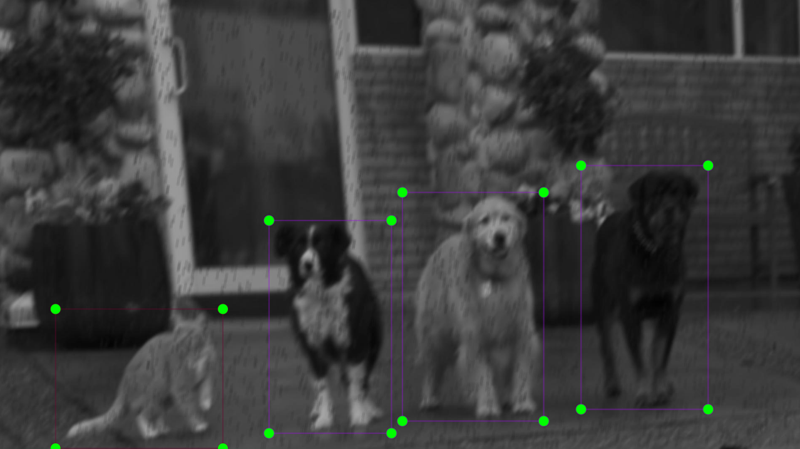

# Image preprocessing
- - -
## Image and bounding box augmentation with Albumentation
Increasing the dataset with the help of augmentation leads to the fact that after N transformations, it is necessary to label N times more data for detection tasks.
Below is the pipeline for automatically expanding a dataset and its bounding boxes by N times.
## Example
- - - 
Below image can be augmented to the following images.


| Example 1                              | Example 2                              | Example 3                              | Example 4                              |
|----------------------------------------|----------------------------------------|----------------------------------------|----------------------------------------|
|  |  |  |  |
## Usage
- - -
- ### Prepare data:
    Specify parameters in the config `preproc_cfg.yaml`:
```yaml
path_initial_img: 'data/initial_images/'
path_preproc_img: 'data/preprocess_images/'
path_dataset: 'data/Dataset/'
```
```commandline
python3 preprocess.py --prepare --cfg cfgs/preproc_cfg.yaml --name_cls Class_0 --verbose
```
- ### Expand and split dataset:
    Specify parameters in the config `preproc_cfg.yaml`:
```yaml
size_train: 0.6
size_val: 0.2
size_test: 0.2
```
```commandline
python3 preprocess.py --form_dataset --cfg cfgs/preproc_cfg.yaml --name_cls Class_0 --num_transform N --verbose
```
Dataset structure after executing this command: 
```
      app_preprocess
      ├── data
      │   ├── initial_images                
      │   │   └── ...
      │   ├── preprocess_images                
      │   │   └── ...
      │   └── Dataset                
      │       ├── Class_0
      │       │   ├── train
      │       │   │   ├── images
      │       │   │   └── labels
      │       │   ├── val
      │       │   │   ├── images
      │       │   │   └── labels
      │       │   └── test
      │       │       ├── images
      │       │       └── labels
      │       ├── ...
      │       └── ...
      └── ...
```
- ### Update all files of classes.txt
    Specify parameters in the config `preproc_cfg.yaml`:
```yaml
nc: 2
names: [
  'Dog',
  'Cat'
]
```
```commandline
python3 preprocess.py --cfg cfgs/preproc_cfg.yaml --upd_cls_txt --verbose
```